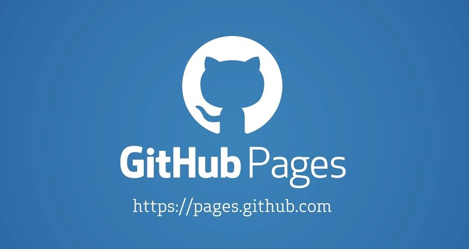
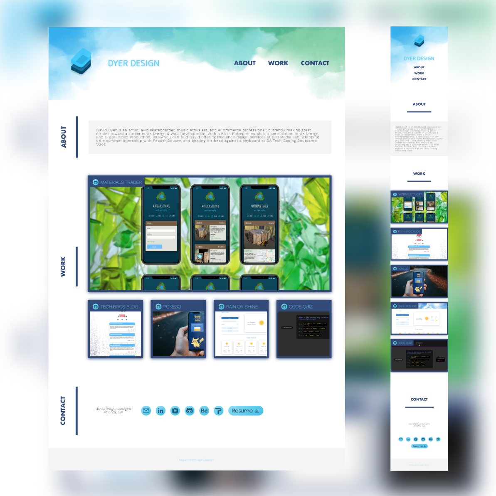

# portfolio-dyer.design

<br />

## Table of Contents

- [Description](#description)
- [User Story](#user-story)
- [Deployment](#deployment)
- [Demo](#demo)
- [Criteria](#criteria)

<br />
<br />

## Description

👔

This is a portfolio page representing my proudest works, developed throughout the Fall 2021 semester at GA Tech coding BootCampSpot.

<br />
<br />

## User Story

```
AS AN employer
I WANT to view a potential employee's deployed portfolio of work samples
SO THAT I can review samples of their work and assess whether they're a good candidate for an open position
```

<br />
<br />

## Deployment

**View on:**

[](https://djdyer.github.io/portfolio-djdyer/)

<br />
<br />

## Demo



<br />
<br />

## Criteria

✅

```
Portfolio page presents potential employee's previous work

Includes name, photo or avatar, links to about, work, and contact

Functional links in nav scroll to corresponding section

Work displays titled images, larger feature, and functional links to project detail

Features responsive sizing for desktop and mobile views
```

<br />
<br />
<br />
Thanks for taking a look!

🤓
